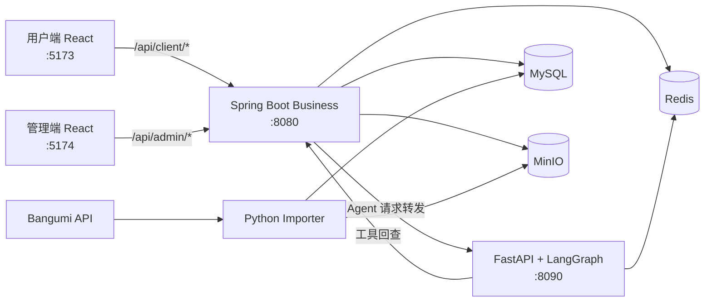

# AnimeTracker · 番组手账

> 一个以 AI Agent 为核心的动漫发现与追番平台：用自然语言描述偏好，让 Agent 检索实时番剧数据、解释推荐理由，并在用户确认后更新收藏与观看进度。

AnimeTracker 是一个覆盖用户端、管理端、业务服务、AI Agent、数据导入与生产部署的个人全栈项目。它不把大模型停留在“聊天框”层面，而是通过可观察的工具调用接入真实业务数据，并为写操作提供预览、确认和执行闭环。

## 项目亮点

- **面向真实数据的 Agent**：将问题路由到搜索、发现或推荐 Agent，再调用业务 API 获取实时番剧、标签、季度与收藏数据。
- **可控的业务写入**：加入“想看”和批量更新追番进度均采用“预览 → 用户确认 → 执行”，待确认状态持久化到 Redis，避免模型直接修改数据。
- **流式交互体验**：基于 SSE 增量返回思考、回答和工具调用状态，前端可实时展示 Agent 的执行过程。
- **完整全栈链路**：React 双前端、Spring Boot 多模块业务后端、FastAPI/LangGraph Agent、MySQL/Redis/MinIO 基础设施协同工作。
- **从数据到交付**：包含 Bangumi 数据导入、Docker Compose 部署、自动化备份恢复、结构化日志、健康检查以及 CI/CD 流水线。

## Agent 核心体验

一次推荐请求会穿过完整的前后端与 Agent 工具链：


Agent 侧使用一张 LangGraph 状态图完成角色检查、意图路由与领域处理。搜索、发现和推荐节点共享流式执行管道，但只暴露各自需要的工具；涉及收藏的操作由系统注入已确认的状态，模型不能自行构造待写入数据。

## 功能概览

### 用户端

- 按关键词、季度和标签浏览或搜索番剧
- 查看条目详情、剧集信息与放送时间表
- 管理“在看 / 想看 / 看过”状态与剧集进度
- 使用自定义标签、评分与收藏整理个人片单
- 与 AI Agent 对话，获取搜索结果、内容发现和个性化推荐
- 查看会话历史、流式回答与工具调用状态

### 管理端

- 管理员登录与数据仪表盘
- 番剧、用户、导入任务和操作日志管理
- Agent 提示词与运行时模型配置

> **当前状态：** 管理端仍有部分功能开发中。登录、仪表盘、番剧、用户、导入、日志与 Agent 配置均已接入真实 API，管理员 Agent 能力、细粒度权限和交互体验持续完善；用户端、业务后端、Agent 与数据导入链路可用。

## 系统架构



开发环境中，两个 Vite 前端统一将 `/api` 代理到业务后端。Python Agent 作为独立推理服务，由 Spring Boot 代理层转发请求；Agent 再通过受控工具回查业务 API，前端不会直接访问 Agent 服务。
## 认证会话

登录、邮箱验证和刷新接口只返回短期 Access Token 与用户信息；刷新凭据由业务服务写入 `at_refresh` HttpOnly、SameSite=Lax Cookie，前端仅在当前标签页内存保存 Access Token，不写入 localStorage。刷新会话空闲 7 天或绝对 30 天过期，退出登录、改密、重置密码、禁用账户和角色变更会撤销相关会话。Cookie 默认启用 Secure；生产环境保持 `AT_AUTH_COOKIE_SECURE=true`，本地 HTTP 开发才显式设置为 false，并将前后端部署在同源地址；刷新/退出请求要求匹配 CORS Origin。已有数据库请执行 [`docs/database/migrations/2026-08-27-user-enabled.sql`](docs/database/migrations/2026-08-27-user-enabled.sql)。

## 技术栈

| 领域 | 技术 |
|---|---|
| 用户端 / 管理端 | React 18、TypeScript、Vite 6、Ant Design 5、TanStack Query、Zustand、React Router 7 |
| 业务后端 | Java 21、Spring Boot 3.2、MyBatis-Plus、JWT |
| AI Agent | Python、FastAPI、LangGraph、LangChain、SSE |
| 模型接入 | DeepSeek 或阿里云百炼 DashScope；配置两者时优先 DeepSeek |
| 数据与存储 | MySQL 8、Redis、MinIO |
| 数据导入 | Python、SQLAlchemy、Bangumi API |
| 工程交付 | Docker Compose、Nginx、GitHub Actions、GHCR |

## 工程设计

### Agent 编排

- 入口先按用户角色分流，再由结构化路由选择搜索、发现或推荐节点。
- 领域节点按最小权限组合工具，并通过统一事件总线输出回答、思考与工具生命周期事件。
- 会话、消息、托管提示词、运行时模型配置和待确认动作统一存储在 Redis。
- DeepSeek 与 DashScope 使用同一模型配置入口；未配置任一有效 API Key 时 Agent 拒绝启动。

### 安全写操作

Agent 对收藏和进度的修改不是一次性工具调用：

1. 先查询当前状态并生成预览；
2. 将强类型待确认动作写入 Redis，并设置有效期；
3. 只有用户明确确认后，才使用系统保存的参数执行；
4. 对成功、跳过和失败结果分类反馈，基础设施异常时保留可重试状态。

这一设计将自然语言交互与确定性的业务约束分开，避免重复收藏、覆盖已有状态或由模型编造写入参数。

### 可观测性与交付

- Nginx、Business 与 Agent 共享 `X-Request-ID`，输出单行 JSON 结构化日志。
- Business 和 Agent 均提供健康检查，Agent 故障不会阻断普通番剧与收藏业务。
- CI 自动运行 Maven 测试、Agent pytest、两端前端构建、Compose 配置校验和镜像构建。
- 版本标签触发 GHCR 镜像发布；生产脚本覆盖部署、回滚、备份和恢复流程。

## 目录结构

```text
AnimeTracker/
├── frontend/
│   ├── client/              # 用户端 React 应用
│   └── admin/               # 管理端 React 应用（部分功能开发中）
├── backend/
│   ├── business/            # Spring Boot 多模块业务后端
│   │   ├── common/          # 通用配置、鉴权、异常与基础能力
│   │   ├── pojo/            # Entity / DTO / VO
│   │   ├── client/          # 用户端业务 API
│   │   ├── admin/           # 管理端业务 API
│   │   ├── agent/           # Agent HTTP 代理层
│   │   └── app/             # Spring Boot 启动模块
│   └── agent/
│       ├── app/             # FastAPI、LangGraph、工具与流式事件
│       ├── importer/        # Bangumi 数据导入器
│       └── tests/           # Agent 自动化测试
├── deploy/                  # Nginx、证书、部署与备份恢复脚本
├── docs/                    # 数据库脚本与 OpenAPI 规范
├── compose.yml              # 基础服务编排
└── compose.prod.yml         # 生产环境覆盖配置
```

## 快速体验

当前项目未提供长期在线演示，需要在本地或服务器运行。完整生产部署步骤见 [`deploy/README.md`](deploy/README.md)。

### 环境要求

- Docker Engine 与 Docker Compose v2
- 至少一个 LLM API Key：`DEEPSEEK_API_KEY` 或 `DASHSCOPE_API_KEY`
- 可用的域名与证书邮箱（生产 HTTPS 部署）

### Docker Compose

```bash
# 1. 创建环境配置并填写数据库、JWT、对象存储和 LLM 等必要密钥
cp .env.example .env

# 2. 校验最终配置
docker compose -f compose.yml -f compose.prod.yml config

# 3. 启动服务
docker compose -f compose.yml -f compose.prod.yml up -d

# 4. 查看健康状态
docker compose -f compose.yml -f compose.prod.yml ps
```

需要演示数据时，可显式运行 `tools` profile 下的 seeder：

```bash
docker compose -f compose.yml -f compose.prod.yml --profile tools run --rm demo-seeder
```

> Compose 配置面向生产部署，仅 Nginx 暴露宿主机 `80/443`。本地逐模块开发、数据库初始化和环境变量说明请查阅下方子模块文档。

## 本地开发入口

各服务推荐按“基础设施 → Business → Agent → 前端”的顺序启动。

| 服务 | 默认端口 | 入口文档 |
|---|---:|---|
| 用户端 | `5173` | [`frontend/client/README.md`](frontend/client/README.md) |
| 管理端 | `5174` | [`frontend/admin/README.md`](frontend/admin/README.md) |
| Business API | `8080` | [`backend/business/README.md`](backend/business/README.md) |
| AI Agent | `8090` | [`backend/agent/README.md`](backend/agent/README.md) |
| 数据导入器 | CLI | [`backend/agent/importer/README.md`](backend/agent/importer/README.md) |

其他入口：

- 数据库 Schema：[`docs/database/db-schema.sql`](docs/database/db-schema.sql)
- OpenAPI 规范：[`docs/spec/openapi.yaml`](docs/spec/openapi.yaml)
- 部署与运维：[`deploy/README.md`](deploy/README.md)
- 前端总览：[`frontend/README.md`](frontend/README.md)
- 后端总览：[`backend/README.md`](backend/README.md)

## 项目状态

| 模块 | 状态 |
|---|---|
| 用户端 | 可用，支持番剧浏览、搜索、收藏、进度与 Agent 对话 |
| 业务后端 | 可用，覆盖用户端、管理端与 Agent 代理 API |
| AI Agent | 可用，支持搜索、发现、推荐、流式响应与待确认动作 |
| 数据导入 | 可用，支持从 Bangumi 按季度或增量导入 |
| 管理端 | **部分功能开发中**，核心数据页面已接入 API，管理员 Agent 与细粒度权限持续完善 |
| 部署与 CI/CD | 已提供 Compose、运维脚本、自动化测试与镜像发布流程 |

## 提交规范

仓库采用约定式提交，正文使用中文：

```text
<type>(<scope>): <subject>

feat(agent): 增加推荐结果加入想看的确认流程
fix(auth): 修复登录页面空值处理
docs: 更新项目架构说明
```

可用类型包括 `feat`、`fix`、`docs`、`style`、`refactor`、`perf`、`test`、`chore` 和 `ci`，详见根目录 `.gitmessage`。
