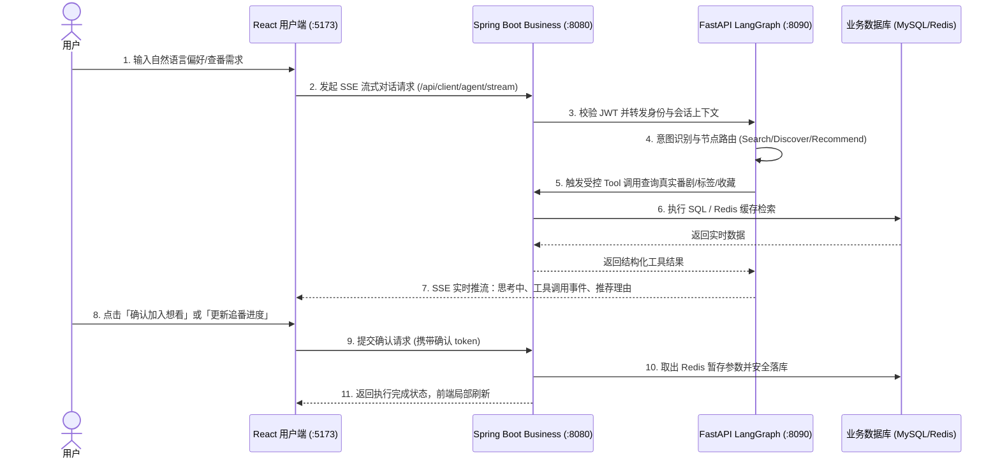
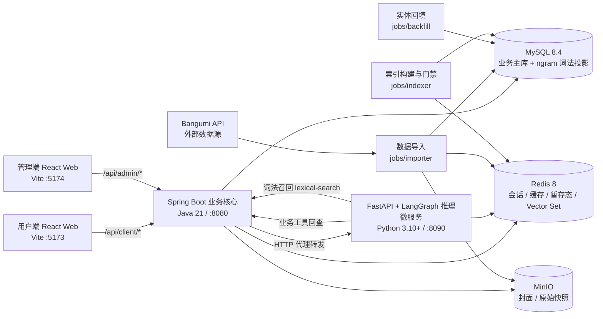

# AnimeTracker · 番组手账

<p align="center">
  <strong>基于 LangGraph Agent + Spring Boot + React 的面向真实业务数据的智能动漫追番平台</strong>
</p>

<p align="center">
  
  
  
  
  
  
  
  
</p>

---

## 📖 项目简介

**AnimeTracker（番组手账）** 是一个以 **AI Agent** 为核心的下一代动漫发现与追番全栈系统。用户可以通过自然语言直接与智能体对话，表达看番偏好、探索季度新番或检索特定题材，由智能体实时调用业务系统工具进行精准数据召回，并给出推荐理由与执行过程。

> **一句话定位（核心定位）**：AnimeTracker 不是简单的聊天包装，而是将大模型深度接入真实业务数据与状态的全栈工程范例——前端提供响应式交互与流式对话，Spring Boot 负责数据治理与企业级鉴权，Python Agent 负责多节点协同推理与工具调用，写操作一律遵循「预览 → 用户确认 → 执行」的安全闭环。

---

## 🎯 适用场景

- **个人追番管理**：按关键词、季度、标签浏览番剧，维护「在看 / 想看 / 看过」与剧集进度，查看放送日历。
- **AI 辅助发现**：用自然语言描述偏好，获得搜索、发现或个性化推荐结果，并可在对话中确认后批量加入想看、更新追番进度。
- **数据自建与检索增强**：从 Bangumi 采集番剧、人物、角色与关系数据，构建 MySQL 词法 + Redis 向量双投影索引，支持带证据的检索问答。
- **管理端运营**：仪表盘统计、番剧 / 用户 / 导入任务 / 操作审计日志管理，以及提示词与模型配置热更新。
- **全栈工程参考**：覆盖前后端分离、多模块后端、端口与适配器分层、SSE 流式、跨层契约校验、结构化日志、发布门禁与 CI 的完整链路。

**不适合的场景**：仓库不提供托管部署编排与在线演示，也不含容器镜像与反向代理配置，需要自行准备 MySQL、Redis、MinIO 与 LLM API Key 后逐模块本地启动。

---

## 🌟 核心特性与设计亮点

- 🤖 **真实数据驱动的多 Agent 协同**：
  - 基于 **LangGraph** 状态图编排，按角色与意图自动路由至 **Search（精准搜索）**、**Discover（新番与多维发现）**、**Recommend（个性化推荐）** 或 **Admin（管理端运维）** 节点。
  - 各节点采用最小权限原则暴露专属业务工具，支持回查实时番剧、标签、放送时间表及用户收藏。
- 🛡️ **确定性安全写机制（Human-in-the-Loop）**：
  - 涉及追番状态（想看/在看/看过）与剧集进度的写操作，模型**不可**直接构造参数写入数据库。
  - 采用 **「查询比对 → 生成预览 → Redis 暂存待确认动作 → 前端用户明确确认 → 系统受控执行」** 机制，杜绝模型幻觉导致的误写或覆写。
- ⚡ **全链路 SSE 实时流式交互**：
  - 前后端全流程打通 `Server-Sent Events`，增量推送思考过程、工具调用状态、结构化卡片与回答内容，前端平滑渲染。
- 📦 **完备的 Bangumi 数据同步管线**：
  - 内置数据导入器（`jobs/importer`），支持按季度（season）、全量（full）、增量（recent/since）与小样本（sample）从 Bangumi API 同步数据，支持断点续传与 MySQL 进程锁。
  - 新增人物/角色实体渐进回填任务（`jobs/backfill`），补齐摘要与详情字段。
- 🔍 **证据可追溯的混合检索（RAG）**：
  - **MySQL 8.4 `ngram` FULLTEXT** 负责词法召回，**Redis 8 Vector Set** 负责语义召回，经 **Python RRF** 融合。
  - 检索结果必须经 Business 权威回查后才对模型可见，并补充结构化 Evidence（简介、匹配标签/主创/角色/关系、评分、播出状态、来源链接），提示词约束模型只能依据证据陈述事实。
  - 索引切换由 **fail-closed 发布门禁** 控制：只有 `quality` / `capacity` / `eval` / `latency` / `human` 五份报告全部通过才允许激活新版本。
- 🔐 **严谨的双 Token 认证体系**：
  - 内存短期 Access Token（30分钟）+ `HttpOnly / SameSite=Lax` Cookie 轮换 Refresh Token（空闲7天/上限30天）。
  - 支持改密、注销、角色变更等多端会话秒级失效与 CORS 严格同源防御。
- 📊 **现代企业级双端架构**：
  - **用户端**：番剧索引、多条件筛选、放送日历、个性化收藏管理、流式 AI 助手。
  - **管理端**：ECharts 数据可视化看板、番剧/用户/操作审计日志管理、Redis 动态 Prompt 提示词/模型配置热更新、管理员专属数据抓取 Agent。

---

## 📐 系统架构与交互设计

### 端到端调用时序



### 系统组件拓扑图



> 检索链路：Agent 先经 Business 的 `/api/client/subjects/lexical-search` 拿到同版本候选，再对同版本 Redis Vector Set 执行 `VSIM`，RRF 融合后回查 Business 权威数据与 Evidence。

---

## 🛠️ 技术栈一览

| 领域 | 选型与版本 | 用途与说明 |
|:---|:---|:---|
| **用户端 / 管理端** | React 18, TypeScript 5, Vite 5, Ant Design 5, TanStack Query 5, Zustand 4, React Router 7 | 响应式单页应用，通过 npm Workspaces 共享 `@animetracker/shared` 逻辑包 |
| **数据可视化** | ECharts 6, `echarts-for-react` 3 | 管理端数据看板图表与统计分析 |
| **业务后端** | Java 21, Spring Boot 3.2.0, MyBatis-Plus 3.5.5, JJWT 0.12.3 | 核心 REST API、端口适配器分层架构、JWT 鉴权、Agent 请求代理 |
| **AI 智能体** | Python 3.10+, FastAPI, LangGraph, LangChain, SSE | 状态图路由、工具编排、上下文与多轮对话管理、流式事件派发 |
| **LLM 接入** | DeepSeek 直连 或 阿里云百炼 DashScope | 通过 `LLM_PROVIDER` 显式切换模型底座与推理服务 |
| **检索与嵌入** | MySQL 8.4 `ngram` FULLTEXT, Redis 8 Vector Set, DashScope `text-embedding-v4`（1024 维）, Python RRF | 词法 + 语义双路召回与融合排序 |
| **数据与存储** | MySQL 8.4, Redis 8, MinIO | 关系型持久化存储、分布式会话/限流/暂存态/向量集、对象存储 |
| **离线与数据工程** | Python, SQLAlchemy, `requests` | 数据采集、增量同步与断点续传、实体回填、索引构建与发布门禁 |
| **工程交付与构建** | uv (Python 包管理), Maven 3.9+, npm workspaces, GitHub Actions | 现代化依赖管理、多模块构建与 CI 门禁检查 |

---

## 📂 项目目录结构

```text
AnimeTracker/
├── frontend/                     # 前端根目录 (npm workspaces: client, admin, packages/shared)
│   ├── client/                   # 用户端 React 单页应用 (Vite :5173)
│   ├── admin/                    # 管理端 React 单页应用 (Vite :5174)
│   ├── packages/
│   │   └── shared/               # 共享包 @animetracker/shared (API / 鉴权 / SSE / 类型 / 公共组件)
│   └── package.json
├── backend/
│   ├── business/                 # Spring Boot 多模块业务工程 (Java 21, 端口 :8080)
│   │   ├── common/               # 公共基础：Result、异常、鉴权、限流、对象存储端口
│   │   ├── pojo/                 # Entity 实体类、DTO 数据传输对象、VO 视图对象
│   │   ├── client/               # 用户端核心业务 API (番剧检索、收藏、进度、Evidence、个人中心)
│   │   ├── admin/                # 管理端业务 API (仪表盘、条目管理、用户管理、审计日志)
│   │   ├── agent/                # Agent 代理转发模块 (对前端封装 Agent 调用接口)
│   │   └── app/                  # Spring Boot 启动模块、配置类、Security 与 Infrastructure 适配器
│   └── agent/                    # AI Agent 智能体微服务 (FastAPI + LangGraph, 端口 :8090)
│       ├── main.py               # FastAPI 服务入口
│       ├── pyproject.toml / uv.lock # Python 依赖定义
│       ├── app/                  # 应用层：agent 编排、entities 实体、chat 协议、rag 检索、adapters 适配器
│       ├── jobs/                 # 离线任务 (importer 导入、backfill 回填、indexer 索引、scheduler 调度)
│       ├── resources/            # 预置本地提示词 Markdown (支持 Redis 托管热更新)
│       └── tests/                # pytest 测试与确定性评测框架
├── docs/                         # 项目全量文档中心
│   ├── database/                 # 数据库初始化脚本与版本化前向迁移
│   ├── spec/                     # OpenAPI 3.0 接口规范定义 (openapi.yaml)
│   ├── conventions/              # 后端架构规范与编码守则 (backend-conventions.md)
│   ├── retrospective/            # 阶段性设计复盘
│   └── superpowers/              # 规划、设计与交接文档（本地产物，不入版本控制）
├── .trellis/                     # Trellis 任务与工作区管理（开发流程工具链）
└── .github/workflows/            # GitHub Actions 持续集成工作流
```

---

## ⚡ 前置依赖要求

请在本地启动前确保安装并配置好以下基础环境：

| 环境组件 | 最低版本要求 | 检查命令 / 说明 |
|:---|:---|:---|
| **Node.js & npm** | Node 22 (推荐 LTS) / npm 10+ | `node -v` / `npm -v` |
| **JDK** | 21 及以上 | `java -version`（Maven Enforcer 插件强制约束 `[21,)`） |
| **Maven** | 3.9 及以上 | `mvn -v`（强制约束 `[3.9,)`） |
| **Python** | 3.10 及以上 | `python --version` |
| **uv** | 最新版 | `uv --version`（极速 Python 包与虚拟环境管理工具） |
| **MySQL** | 8.0+；启用检索需 **8.4** | 默认库名 `anime_tracker`，字符集 `utf8mb4`；词法投影使用 `ngram` FULLTEXT |
| **Redis** | 5.0+；启用检索需 **8** | 缓存、会话管理、Prompt 托管与暂存态存储；RAG 语义召回依赖 Redis 8 **Vector Set**（`VADD` / `VSIM` / `VREM` / `VEMB`） |
| **MinIO** | 任意版本 | 对象存储（公开封面桶与私有快照桶） |
| **LLM Key** | — | `DEEPSEEK_API_KEY` 或 `DASHSCOPE_API_KEY`（二选一）；启用检索还需 `DASHSCOPE_API_KEY` 用于嵌入 |

---

## 🚀 快速开始（本地启动指南）

建议按照 **「初始化数据库 → 启动业务后端 → 启动 AI Agent → 启动前端应用」** 的顺序执行。

### 1. 初始化数据库

```bash
# 登录 MySQL 并创建数据库
mysql -u root -p -e "CREATE DATABASE anime_tracker DEFAULT CHARACTER SET utf8mb4 COLLATE utf8mb4_unicode_ci;"

# 执行建表与初始数据脚本 (唯一事实来源)
mysql -u root -p anime_tracker < docs/database/db-schema.sql
```

> 若是**已有数据的存量库**，不要重复执行初始化脚本，改用版本化前向迁移：先执行 `docs/database/migration-002-rag-entities.sql`，再执行 `docs/database/migration-003-search-projection.sql`。执行前请完成可恢复备份。

### 2. 启动 Spring Boot 业务后端 (:8080)

```bash
cd backend/business

# 编译并安装公共依赖
mvn clean install -DskipTests

# 本地 Profile 启动 (可在 app/src/main/resources/application-local.yml 配置数据库与 Redis 连接)
mvn -pl app spring-boot:run -Dspring-boot.run.arguments=--spring.profiles.active=local
```

### 3. 启动 FastAPI + LangGraph Agent (:8090)

```bash
cd backend/agent

# 配置环境变量 (填写 LLM_PROVIDER、API_KEY 与 REDIS_URL)
cp .env.example .env

# 使用 uv 同步虚拟环境依赖
uv sync --dev

# 启动 Agent API 服务
uv run uvicorn main:app --reload --port 8090
```

> ⚠️ **模板存在一处已知不一致**：`.env.example` 仍保留已被 `app/config.py` 移除的 `RAG_INDEX_ALIAS`。由于 `Settings` 使用 `extra="forbid"`，直接照抄模板会导致启动报 `Extra inputs are not permitted`。**请从 `.env` 中删除该行**，详情见下方 FAQ。

### 4. 启动前端双应用 (:5173 / :5174)

```bash
cd frontend

# 安装 npm workspaces 依赖
npm install

# 终端 1：启动用户端 (http://localhost:5173)
npm run dev:client

# 终端 2：启动管理端 (http://localhost:5174)
npm run dev:admin
```

> **说明**：前端 Vite 开发服务器已内置代理配置，`/api/*` 请求会自动转发至业务后端 `http://localhost:8080`，无需额外配置 CORS。

### 5. 导入首批番剧数据

在 `backend/agent` 目录下执行导入命令：

```bash
cd backend/agent

# 示例：导入 2026 年夏季番剧数据 (5 线程并发)
uv run python -m jobs.importer.main --mode season --key 2026-summer --workers 5

# 示例：快速小样本试水导入 (导入 50 部)
uv run python -m jobs.importer.main --mode sample --limit 50
```

### 6. 构建检索索引（可选）

RAG 默认关闭（`RAG_ENABLED=false`）。启用前需先构建索引并通过发布门禁：

```bash
cd backend/agent

# 生成待索引任务并构建 v1 版本索引（MySQL 词法投影 + Redis Vector Set）
uv run python -m jobs.indexer.main --index-version v1 --queue both --limit 10

# 门禁校验：五份报告全部通过后才允许激活
uv run python -m jobs.indexer.gate --index-version v1 --report-dir ./reports --activate
```

激活成功后把 `.env` 的 `RAG_ENABLED` 改为 `true` 并重启 Agent。

---

## 🔍 核心用法示例（服务自检与 API 验证）

启动完成后，可通过以下命令进行服务连通性与健康状态验证：

```bash
# 1. 业务后端健康检查 (要求 MySQL 与 Redis 正常连接)
curl http://localhost:8080/actuator/health

# 2. Agent 服务健康检查
curl http://localhost:8090/api/client/agent/health

# 3. 体验 Agent 对话流式接口 (通过 business 代理层调用)
curl -N -X POST http://localhost:8080/api/client/agent/stream \
  -H "Authorization: Bearer <YOUR_ACCESS_TOKEN>" \
  -H "Content-Type: application/json" \
  -d '{"sessionId": null, "message": "推荐几部近期高评分的热血动作番"}'

# 4. 词法检索契约（Agent 检索链路的第一跳）
curl -X POST http://localhost:8080/api/client/subjects/lexical-search \
  -H "Authorization: Bearer <YOUR_ACCESS_TOKEN>" \
  -H "Content-Type: application/json" \
  -d '{"q":"治愈 日常","limit":15}'
```

---

## ❓ 常见问题与排障指南 (FAQ)

<details>
<summary><strong>Q: Agent 启动报错 <code>LLM API Key 未配置</code> 或模型无法调用？</strong></summary>

**A**: 请检查 `backend/agent/.env` 文件。
1. 确保设置了 `LLM_PROVIDER=deepseek` 或 `LLM_PROVIDER=dashscope`。
2. 确保配置了对应有效的 `DEEPSEEK_API_KEY` 或 `DASHSCOPE_API_KEY`。若未配置任何有效 Key，服务会在启动阶段主动拦截并报错退出。
</details>

<details>
<summary><strong>Q: Agent 启动报错 <code>Extra inputs are not permitted</code>？</strong></summary>

**A**: `Settings` 配置模型开启了严格校验（`extra="forbid"`）。请勿在 `.env` 中加入未在 `backend/agent/app/config.py` 中声明的多余环境变量。
**注意**：当前 `backend/agent/.env.example` 仍包含已废弃的 `RAG_INDEX_ALIAS`（代码中该配置已被移除，改为由 MySQL `search_index_release` 作为唯一激活指针）。照抄模板会直接触发此错误，请删除该行后再启动。
</details>

<details>
<summary><strong>Q: 登录或刷新 Token 后前端立即掉线 / Cookie 无法写入？</strong></summary>

**A**: 本地通过 HTTP 协议开发时，请设置环境变量 `AT_AUTH_COOKIE_SECURE=false`（对应 `application.yml` 中的 `at.auth.refresh-cookie.secure`），否则浏览器会拒绝接收非 HTTPS 环境下的 `at_refresh` Cookie。
</details>

<details>
<summary><strong>Q: 对话时报错 401 Unauthorized？</strong></summary>

**A**: 业务后端与 Agent 采用共享密钥机制在本地对 JWT 进行独立验签。请确保 `backend/business` 中的 `jwt.secret` 配置与 `backend/agent/.env` 中的 `JWT_SECRET` **完全一致**。
</details>

<details>
<summary><strong>Q: 数据导入任务提示锁冲突或无法重复启动？</strong></summary>

**A**: 导入器通过 MySQL `GET_LOCK` 保证全局单实例执行，并在 `jobs/importer/importer.pid` 写入进程标识。若由于异常终止导致锁未释放，可确认进程退出后清理 pid 文件，或调用 Agent 的清理接口。
</details>

<details>
<summary><strong>Q: 开启了 <code>RAG_ENABLED=true</code>，但检索始终走不到向量召回？</strong></summary>

**A**: Agent 启动时会探测 Redis 是否支持 Vector Set 命令（`VADD` / `VSIM` / `VREM`）。若 Redis 版本低于 8 或未启用该能力，会记录「Redis 未启用 Vector Set」并**保持检索关闭**（fail-closed），自动降级为 Business 普通搜索。请升级到 Redis 8 并确认索引已按门禁激活。
</details>

<details>
<summary><strong>Q: 索引构建完成，但 <code>gate</code> 一直返回 FAIL？</strong></summary>

**A**: 发布门禁采用 fail-closed 策略，要求 `--report-dir` 下同时存在 `quality` / `capacity` / `eval` / `latency` / `human` 五份报告，且契约（版本、嵌入参数、内容哈希）一致。任一报告缺失或版本不匹配都会拒绝激活，不会退回「默认通过」。
</details>

<details>
<summary><strong>Q: 存量库升级时应该执行哪个 SQL？</strong></summary>

**A**: 全新空库执行 `docs/database/db-schema.sql`（含 23 张表的完整结构）；已有数据的库存量升级按顺序执行 `migration-002-rag-entities.sql`（新增 9 张实体/关系/任务表）与 `migration-003-search-projection.sql`（新增 `search_document`、`search_index_release`）。两个迁移脚本均使用 `CREATE TABLE IF NOT EXISTS`，可重复执行。
</details>

---

## 📝 提交规范与协作

本项目遵循统一的 Git Commit 提交信息模板（中文简述，50字以内）：

```text
<type>(<scope>): <subject>

<body>
```

**Type 类型定义**：
- `feat`: 新增功能特性
- `fix`: 缺陷修复
- `docs`: 文档变更
- `style`: 样式或格式调整（不影响业务逻辑）
- `refactor`: 代码重构（无新增功能亦无修复缺陷）
- `perf`: 性能优化
- `test`: 补全或重构测试用例
- `chore`: 构建配置、依赖更新或辅助工具变动
- `ci`: CI 流水线相关变更

---

## 🔗 与相邻模块的关联

| 本模块 / 文档 | 关联对象 | 关系说明 |
|:---|:---|:---|
| 根 README（本文档） | 所有子模块 README | 项目总入口，子模块文档均回链至此 |
| `frontend/` | `backend/business` | 仅通过 Vite 代理访问 `/api/**`，不直连 Agent |
| `backend/business/` | `backend/agent` | 代理转发 `/api/*/agent/**`；共享 `JWT_SECRET` 与 MySQL 库 |
| `backend/agent/` | `backend/business` | 双向：作为被代理方接收请求，作为调用方回查业务 API 与 Evidence |
| `backend/agent/jobs/importer/` | `jobs/indexer`、`jobs/backfill` | 导入写入事实表并登记索引任务；回填补齐人物/角色详情 |
| `docs/database/` | business + agent/jobs | 库表结构的唯一事实来源 |
| `docs/spec/openapi.yaml` | `backend/business` | 手工维护的接口契约，用于跨层校验 |
| `.github/workflows/ci.yml` | 前端 / business / agent | 三个并行作业：typecheck、`mvn -B test`、`uv run pytest` |

---

## 📚 子模块与扩展文档导航

- 📘 [后端开发与架构规范](docs/conventions/backend-conventions.md)
- 🗄️ [数据库建表脚本 (db-schema.sql)](docs/database/db-schema.sql)
- 📑 [OpenAPI 3.0 接口规范定义 (openapi.yaml)](docs/spec/openapi.yaml)
- 🖥️ [Spring Boot 业务服务详细文档](backend/business/README.md)
- 🤖 [FastAPI + LangGraph Agent 架构文档](backend/agent/README.md)
- 📥 [Bangumi 数据导入器设计说明](backend/agent/jobs/importer/README.md)
- 📑 [文档索引与归档总览](docs/README.md)
- 🧩 [后端总览](backend/README.md)

---

## ⚠️ 待补充

以下事项在本次文档核对时无法仅从代码确定，需维护者确认后补齐：

1. **前端缺少子包 README**：`frontend/`、`frontend/client/`、`frontend/admin/`、`frontend/packages/shared/` 均无 README。按「不随意增删文件」的要求未新建，前端的页面结构、状态管理约定与组件规范暂无文档入口。
2. **生产部署形态缺失**：仓库中不存在 `deploy/` 目录、`compose.yml` / `compose.prod.yml`、Nginx 配置或进程守护配置。`application.yml` 注释中提到的 `application-prod.yml`（由 `SPRING_PROFILES_ACTIVE=prod` 激活）在 `app/src/main/resources/` 下不存在，生产配置的落地方式待确认。
3. **`.env.example` 与代码不一致**：模板中的 `RAG_INDEX_ALIAS` 已被移除（改为 MySQL `search_index_release` 唯一指针），模板注释中关于「RediSearch/Redis Stack」的描述也已过期（现为 Redis 8 Vector Set）。这属于代码/配置问题而非文档问题，故未直接修改，建议同步修正模板。
4. **`.trellis/` 归档任务文档**：`.trellis/tasks/archive/` 下存在两处 README（任务文档索引与历史报告说明）。它们是被版本跟踪的历史审查记录，且自带「不直接删除审查证据」的维护规则，故本次未按模块文档结构重写；如需一并更新请明确指示。
5. **运行期产物未纳入 `.gitignore`**：`backend/agent/jobs/importer/importer.pid` 与 `backend/agent/indexer-remaining.json` 由任务运行时生成，当前未被忽略规则覆盖（`*.log` 已被忽略）。
6. **`jobs/indexer` 门禁阈值**：`quality` / `capacity` / `eval` / `latency` / `human` 五份报告的合格线随数据规模与嵌入额度变化，代码中未固化建议值，暂无文档化判读基准。

---

<p align="center">
  Crafted with ❤️ for Anime & Agent Enthusiasts.
</p>
