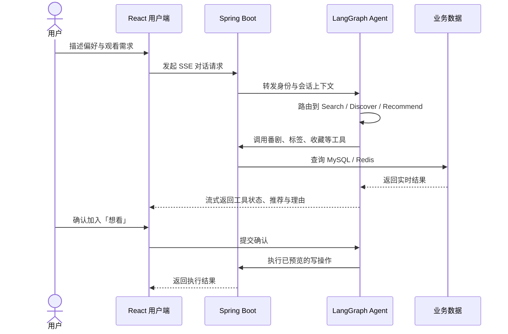
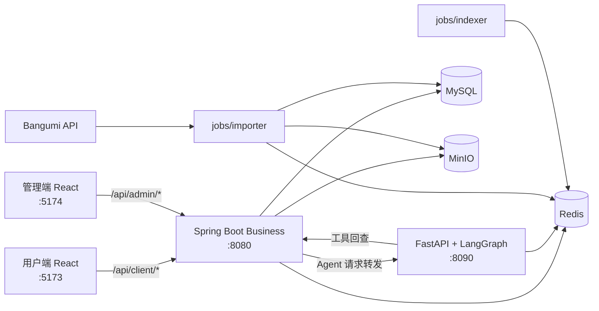

# AnimeTracker · 番组手账

> 一个以 AI Agent 为核心的动漫发现与追番平台：用自然语言描述偏好，让 Agent 检索实时番剧数据、解释推荐理由，并在用户确认后更新收藏与观看进度。

> **一句话定位**：AnimeTracker 是一个把大模型接入真实业务数据的动漫追番全栈项目——前端负责浏览与对话，Spring Boot 负责业务与鉴权，Python Agent 负责推理与工具调用，写操作一律走「预览 → 确认 → 执行」。

## 适用场景

- **个人追番管理**：按关键词、季度、标签浏览番剧，维护「在看 / 想看 / 看过」与剧集进度。
- **AI 辅助发现**：用自然语言向 Agent 提问，获得搜索结果、内容发现或个性化推荐，并查看推荐理由与调用过程。
- **数据自建**：从 Bangumi 拉取番剧元数据、封面与剧集，导入本地数据库，并可按需构建 RAG 向量索引。
- **全栈工程实践**：覆盖前后端分离、多模块后端、端口与适配器分层、SSE 流式、结构化日志、CI 门禁的完整链路。

不适合作为开箱即用的生产 SaaS：仓库不提供托管部署编排与在线演示，需要自行准备 MySQL、Redis、MinIO 与 LLM API Key 后逐模块启动。

## 项目亮点

- **面向真实数据的 Agent**：将问题路由到搜索、发现或推荐 Agent，再调用业务 API 获取实时番剧、标签、季度与收藏数据。
- **可控的业务写入**：加入「想看」和批量更新追番进度均采用「预览 → 用户确认 → 执行」，待确认状态持久化到 Redis，避免模型直接修改数据。
- **流式交互体验**：基于 SSE 增量返回思考、回答和工具调用状态，前端可实时展示 Agent 的执行过程。
- **完整全栈链路**：React 双前端 + 共享包、Spring Boot 多模块业务后端、FastAPI/LangGraph Agent、MySQL/Redis/MinIO 基础设施协同工作。
- **从数据到交付**：包含 Bangumi 数据导入、RAG 索引构建、定时导入调度、结构化日志、健康检查与 CI 流水线。
- **管理端已可用**：登录、仪表盘、番剧、用户、导入、日志、Agent 配置与管理员 Agent 对话均已接入真实 API。

## Agent 核心体验

一次推荐请求会穿过完整的前后端与 Agent 工具链：



Agent 侧使用一张 LangGraph 状态图完成角色分流、意图路由与领域处理。搜索、发现和推荐节点共享流式执行管道，但只暴露各自需要的工具；涉及收藏的操作由系统注入已确认的状态，模型不能自行构造待写入数据。管理员角色走独立的 `admin_agent` 节点，可调用导入工具触发数据抓取。

## 功能概览

### 用户端

- 按关键词、季度和标签浏览或搜索番剧
- 查看条目详情、剧集信息与放送时间表
- 管理「在看 / 想看 / 看过」状态与剧集进度
- 使用自定义标签、评分与收藏整理个人片单
- 与 AI Agent 对话，获取搜索结果、内容发现和个性化推荐
- 查看会话历史、流式回答与工具调用状态

### 管理端

- 管理员登录与数据仪表盘（ECharts 图表）
- 番剧、用户、导入任务和操作日志管理
- Agent 提示词与运行时模型配置（托管在 Redis）
- 管理员专属 Agent 对话（可触发最近新番导入）

> **当前状态：** 用户端、管理端、业务后端、Agent、数据导入与 RAG 索引链路均可用。细粒度权限与交互体验仍在持续完善。

## 系统架构



开发环境中，两个 Vite 前端统一将 `/api` 代理到业务后端（`localhost:8080`）。Python Agent 作为独立推理服务，由 Spring Boot 代理层转发请求；Agent 再通过受控工具回查业务 API，前端不会直接访问 Agent 服务。

## 认证会话

登录、邮箱验证和刷新接口只返回短期 Access Token 与用户信息；刷新凭据由业务服务写入 `at_refresh` HttpOnly、SameSite=Lax Cookie（路径 `/api/client/auth`），前端仅在当前标签页内存保存 Access Token，不写入 localStorage。

- Access Token 默认 30 分钟（`jwt.expiration`），刷新会话空闲 7 天（`jwt.refresh-expiration`）、绝对上限 30 天（`jwt.max-session-expiration`）。
- 退出登录、改密、重置密码、禁用账户和角色变更会撤销相关会话。
- Cookie 默认启用 Secure（`AT_AUTH_COOKIE_SECURE=true`）；本地 HTTP 开发可显式设为 `false`，并将前后端部署在同源地址。
- 刷新 / 退出请求会校验 CORS Origin，需确保 `at.cors.origins` 使用实际前端 Origin。
- Agent 与 business 共享 `JWT_SECRET`，Agent 本地验签，不回调业务后端。

## 技术栈

| 领域 | 技术 |
|---|---|
| 用户端 / 管理端 | React 18、TypeScript 5、Vite 5、Ant Design 5、TanStack Query 5、Zustand 4、React Router 7 |
| 管理端图表 | ECharts 6 + echarts-for-react 3 |
| 业务后端 | Java 21、Spring Boot 3.2.0、MyBatis-Plus 3.5.5、JJWT 0.12.3 |
| AI Agent | Python 3.10+、FastAPI、LangGraph、LangChain、SSE |
| 模型接入 | DeepSeek 官方直连或阿里云百炼 DashScope；由 `LLM_PROVIDER` 显式指定 |
| 数据与存储 | MySQL 8、Redis、MinIO |
| 数据导入 | Python、SQLAlchemy、Bangumi v0 API |
| 工程交付 | uv（Agent 依赖）、Maven（后端）、npm workspaces（前端）、GitHub Actions |

## 工程设计

### Agent 编排

- 入口先按用户角色分流，再由结构化路由选择搜索、发现或推荐节点。
- 领域节点按最小权限组合工具，并通过统一事件总线输出回答、思考与工具生命周期事件。
- 会话、消息、托管提示词、运行时模型配置和待确认动作统一存储在 Redis。
- 未配置任一有效 API Key 时 Agent 拒绝启动（`resolve_llm_provider` 抛错）。
- Agent 采用端口与适配器分层：`app/agent`、`app/chat`、`app/rag` 定义端口，`app/adapters/*` 提供 Redis / MySQL / HTTP / LLM / 子进程实现。

### 安全写操作

Agent 对收藏和进度的修改不是一次性工具调用：

1. 先查询当前状态并生成预览；
2. 将强类型待确认动作写入 Redis，并设置有效期；
3. 只有用户明确确认后，才使用系统保存的参数执行；
4. 对成功、跳过和失败结果分类反馈，基础设施异常时保留可重试状态。

这一设计将自然语言交互与确定性的业务约束分开，避免重复收藏、覆盖已有状态或由模型编造写入参数。

### 可观测性与交付

- Business 与 Agent 输出单行 JSON 结构化日志（`logback-spring.xml` / `app/shared/observability.py`），并透传 `X-Request-ID`。
- Business 提供 Actuator 健康检查：liveness 仅要求进程响应，readiness 要求 MySQL 与 Redis；Agent 与 MinIO 不作为就绪强制条件，避免单点能力故障拖垮整体。
- Agent 提供 `GET /api/client/agent/health`。
- CI 在 push 到 `main` 与所有 PR 上运行三个作业：前端 `npm run typecheck`、后端 `mvn -B test`、Agent `uv run pytest`。

## 目录结构

```text
AnimeTracker/
├── frontend/                # npm workspaces：client + admin + packages/shared
│   ├── client/              # 用户端 React 应用（Vite :5173）
│   ├── admin/               # 管理端 React 应用（Vite :5174）
│   └── packages/shared/     # 共享包 @animetracker/shared（api / auth / sse / types...）
├── backend/
│   ├── business/            # Spring Boot 多模块业务后端（Java 21，:8080）
│   │   ├── common/          # 通用配置、鉴权、异常、限流、对象存储端口
│   │   ├── pojo/            # Entity / DTO / VO
│   │   ├── client/          # 用户端业务 API
│   │   ├── admin/           # 管理端业务 API
│   │   ├── agent/           # Agent HTTP 代理层
│   │   └── app/             # Spring Boot 启动模块与 infrastructure 适配器
│   └── agent/               # FastAPI + LangGraph Agent（Python，:8090）
│       ├── app/             # 端口与适配器：agent / chat / rag / api / adapters
│       ├── jobs/            # 离线任务：importer（导入）、indexer（RAG 索引）、scheduler（定时）
│       ├── resources/       # 本地托管提示词 Markdown
│       └── tests/           # pytest 测试
├── docs/                    # 数据库脚本、OpenAPI 规范、项目规范与规划文档
└── .github/workflows/       # CI 流水线
```

## 前置依赖

| 组件 | 版本要求 | 校验方式 / 用途 |
|------|---------|----------------|
| Node.js | 22（CI 使用 22）与 npm 10+ | 前端 workspaces 安装与类型检查 |
| JDK | 21 及以上 | 由 `maven-enforcer-plugin` 强制 `[21,)` |
| Maven | 3.9 及以上 | 由 `maven-enforcer-plugin` 强制 `[3.9,)` |
| Python | 3.10 及以上 | `pyproject.toml` 声明 `requires-python = ">=3.10"` |
| uv | 最新版 | Agent 依赖由 `uv.lock` 锁定 |
| MySQL | 8 | 主库，库名 `anime_tracker` |
| Redis | 5+ 协议兼容 | 会话、限流、托管提示词、待确认动作、RAG 索引（可选） |
| MinIO | 任意近期版本 | 头像、封面、原始快照存储 |
| LLM API Key | — | `DEEPSEEK_API_KEY` 或 `DASHSCOPE_API_KEY` 至少一个 |

## 快速开始

当前项目未提供长期在线演示，也没有随仓库提供的 Compose 编排，需要在本地逐模块运行。

### 启动顺序

推荐按「基础设施 → 数据库 → Business → Agent → 前端」的顺序启动。

#### 1. 初始化数据库

```bash
mysql -u root -p -e "CREATE DATABASE anime_tracker DEFAULT CHARACTER SET utf8mb4 COLLATE utf8mb4_unicode_ci;"
mysql -u root -p anime_tracker < docs/database/db-schema.sql
```

建表脚本为唯一事实来源，项目不使用 Flyway / Liquibase（`spring.sql.init.mode: never`）。

#### 2. 启动业务后端

```bash
cd backend/business
mvn clean install -DskipTests
mvn -pl app spring-boot:run -Dspring-boot.run.arguments=--spring.profiles.active=local
```

启动前按需修改 `app/src/main/resources/application-local.yml`（数据源、Redis、MinIO、Resend、Agent 地址）。该文件已被 `.gitignore` 忽略，本地可安全填写真实密钥。

#### 3. 启动 AI Agent

```bash
cd backend/agent
cp .env.example .env          # 填写 LLM_PROVIDER 与对应 API Key、REDIS_URL
uv sync --dev
uv run uvicorn main:app --reload --port 8090
```

#### 4. 启动前端

```bash
cd frontend
npm install
npm run dev:client            # 用户端 http://localhost:5173
npm run dev:admin             # 管理端 http://localhost:5174
```

两个 Vite 应用已配置 `/api` 代理到 `http://localhost:8080`，无需额外配置跨域。

### 导入首批数据

```bash
cd backend/agent
uv run python -m jobs.importer.main --mode season --key 2026-summer --workers 5
```

> 想先试水可加 `--dry-run`（仅 `full` 模式，只扫描不写库），或用 `--mode sample --limit 50` 导入小样本。

## 本地开发入口

| 服务 | 默认端口 | 入口文档 |
|---|---:|---|
| 用户端 | `5173` | `frontend/client/`（暂无 README，见下方「待补充」） |
| 管理端 | `5174` | `frontend/admin/`（暂无 README，见下方「待补充」） |
| Business API | `8080` | [`backend/business/README.md`](backend/business/README.md) |
| AI Agent | `8090`（Swagger `/docs`） | [`backend/agent/README.md`](backend/agent/README.md) |
| 数据导入器 | CLI | [`backend/agent/jobs/importer/README.md`](backend/agent/jobs/importer/README.md) |

其他入口：

- 数据库 Schema：[`docs/database/db-schema.sql`](docs/database/db-schema.sql)
- OpenAPI 规范：[`docs/spec/openapi.yaml`](docs/spec/openapi.yaml)
- 后端编码与错误规范：[`docs/conventions/backend-conventions.md`](docs/conventions/backend-conventions.md)
- 文档索引：[`docs/README.md`](docs/README.md)
- 后端总览：[`backend/README.md`](backend/README.md)

## 项目状态

| 模块 | 状态 |
|---|---|
| 用户端 | 可用，支持番剧浏览、搜索、收藏、进度与 Agent 对话 |
| 管理端 | 可用，覆盖仪表盘、番剧、用户、导入、日志与 Agent 配置/对话 |
| 业务后端 | 可用，覆盖用户端、管理端与 Agent 代理 API |
| AI Agent | 可用，支持搜索、发现、推荐、流式响应、待确认动作与 RAG（默认关闭） |
| 数据导入 | 可用，支持 full / season / recent / since / sample 五种模式与断点续传 |
| RAG 索引 | 可用但默认关闭（`RAG_ENABLED=false`），需 DashScope 嵌入模型与独立 Redis |
| 测试与 CI | Agent 有 pytest 用例；business 与前端当前无有效测试用例，CI 只跑类型检查与测试命令 |

## 常见问题

**Q：Agent 启动即报错 `LLM API Key 未配置`？**
A：`.env` 中未设置 `DEEPSEEK_API_KEY` 或 `DASHSCOPE_API_KEY`。若两者都未配置，`resolve_llm_provider` 会直接抛错终止启动。建议同时显式设置 `LLM_PROVIDER=deepseek|dashscope`，否则会回退按 Key 判断并打印告警。

**Q：Agent 启动报 `Extra inputs are not permitted`？**
A：`Settings` 使用 `extra="forbid"`，`.env` 中任何未在 `app/config.py` 声明的变量都会导致启动失败。以 `.env.example` 为模板增删字段即可。

**Q：Business 启动报 `MINIO_RAW_BUCKET must differ from MINIO_BUCKET`？**
A：这是 Agent `Settings` 的校验器（不是 business 的），要求原始快照私有桶与公开封面桶不同名。为 `MINIO_RAW_BUCKET` 配置一个独立桶名。

**Q：前端请求 404 或跨域失败？**
A：确认 business 已启动且 `at.cors.allowed-origins` 包含实际前端 Origin（`application-local.yml` 默认已含 `5173` 与 `5174`）。前端只应访问相对路径 `/api/**`，由 Vite 代理转发，不要直连 `8090`。

**Q：刷新登录态后仍然掉线？**
A：本地 HTTP 环境需设置 `AT_AUTH_COOKIE_SECURE=false`，否则浏览器不会回传 `at_refresh` Cookie。生产环境请保持 `true` 并使用 HTTPS。

**Q：导入任务卡住无法再次启动？**
A：导入器通过 MySQL `GET_LOCK` 保证单实例，并在 `jobs/importer/importer.pid` 写入 PID。异常退出时可通过 Agent 的 `sweep_dead_processes` 清理僵尸记录，或确认 PID 文件与锁已释放后重试。

**Q：CI 为什么没有跑前端构建和后端打包？**
A：当前 `.github/workflows/ci.yml` 只定义三个作业：前端 `npm run typecheck`、后端 `mvn -B test`、Agent `uv run pytest`。构建与镜像发布未纳入 CI。

## 提交规范

仓库根 `.gitmessage` 定义了提交模板：**简短中文描述（50 字以内）**，正文可选，类型为 `feat | fix | docs | style | refactor | perf | test | chore | ci`。

```text
feat(数据): 添加 Bangumi 数据导入器
fix(认证): 修复登录页面未捕获空值异常
docs: 更新 API 使用说明
```

## 待补充

以下事项在本次文档核对时无法从代码中确定，需项目维护者确认后补齐：

1. **前端各包缺少 README**：`frontend/README.md`、`frontend/client/README.md`、`frontend/admin/README.md` 均不存在。按「不随意增删文件」的要求未新建，前端的页面结构、状态管理约定与组件规范暂无文档入口。
2. **部署方案缺失**：仓库中不存在 `deploy/` 目录、`compose.yml` / `compose.prod.yml` 及 `.env.example`（根级）。历史文档提到的 Docker Compose、Nginx、GHCR 镜像发布与备份恢复脚本在当前代码树中均无对应文件，生产部署步骤无法从代码推导。
3. **RAG 索引的运维参数**：`jobs/indexer` 依赖 `rag_index_job` 表与 DashScope 嵌入额度，批次大小、限流退避与容量报告的判读阈值随模型与数据量变化，尚未固化为文档化的建议值。
4. **定时任务宿主**：`jobs/scheduler` 提供 Asia/Shanghai 时区的调度逻辑（每日 03:00 增量、每周日 04:00 年度回溯、每季度首月 05:00 全量），但仓库中未见 systemd / cron / 容器等宿主配置，实际如何常驻运行待确认。
